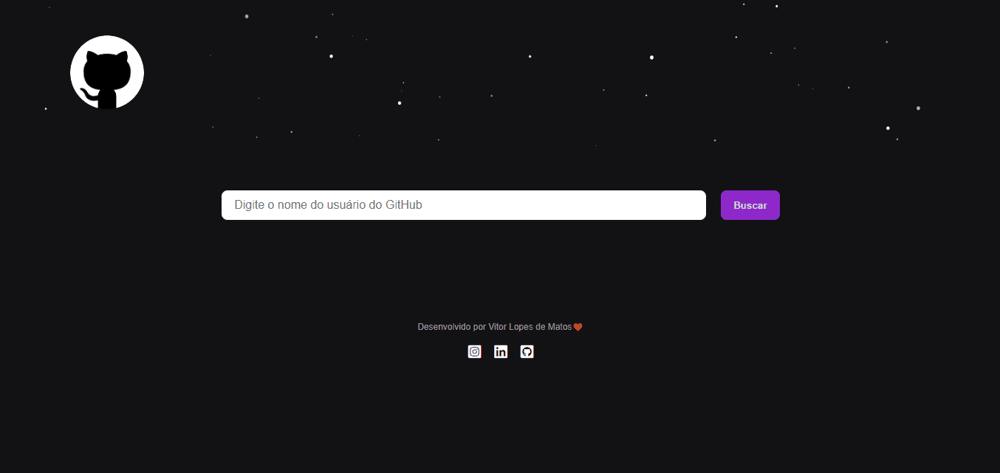

# PROJETO DADOS GITHUB 💻

Projeto pessoal desenvolvido com objetivo de consolidar conhecimentos em relação ao consumo de APIs, além de promover o aperfeiçoamento de boas práticas em relação as tecnologias que foram utilizadas no projeto. A aplicação consiste em buscar dados da API do GitHub em relação ao nome, bio e repositórios do usuário, por meio do nome do usuário, ficou bem legal!🤌

### Imagem do Projeto 👌

### Links

- Deploy: [https://vitorlopes523.github.io/dados-github/]
- Repositório: [https://github.com/vitorlopes523/dados-github]

## Meu processo

### Construído com:

- Marcação semântica HTML5
- Propriedades personalizadas CSS
- Flexbox
- Linguagem de programação JavaScript
- Json

### Link da API:

-Dados do Usuário: [https://docs.github.com/pt/rest/reference/users]
-Dados dos Repositórios: [https://docs.github.com/pt/rest/reference/repos]

### Desenvolvimento contínuo

- Aprimorar conhecimentos em HTML e sua semântica.
- Aprimorar sobre as propriedades de CSS, principalmente flexbox e grid.
- Aprimorar conhecimentos em JavaScript.
- Aprender e aperfeiçoar o framework React.JS.
- Desenvolver técnicas que melhore meu status como profissional.

Espero que tenha gostado!🙂